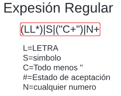
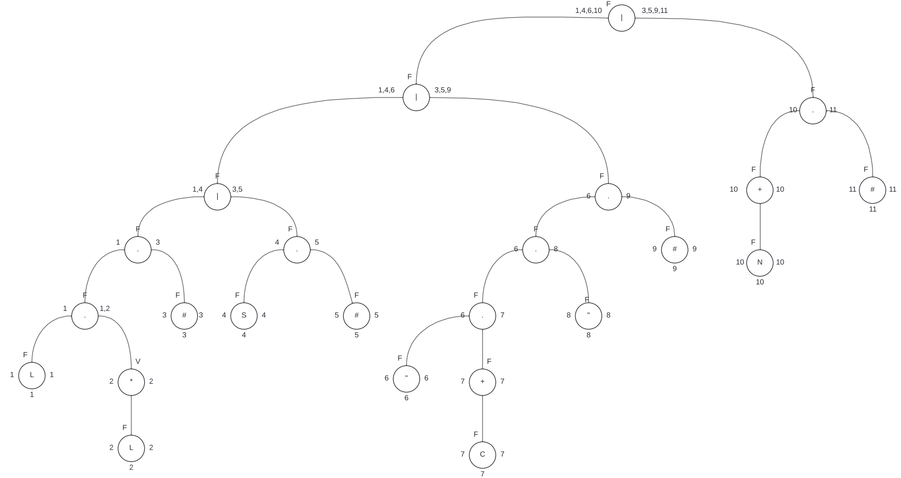
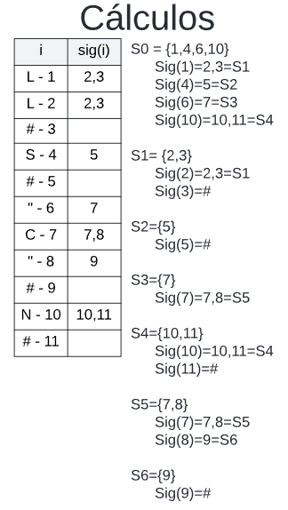
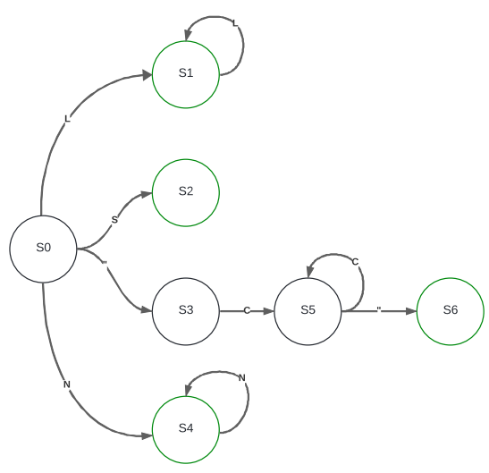

# Manual Técnico - Proyecto 1
## Objetivos
### Objetivo General
- Proporcionar una explicación detallado sobre la utilización del código y la lógica utilizada
### Objetivos Específicos
- Presentar y explicar el funcionamiento del código utilizado para la solución creada
- Detallar la manera en que se idearon las soluciones y la lógica detrás de cada una

## Alcances del Sistema
Este manual se creó con la finalidad de permitir una comprensión profunda sobre la manera en que se realizaron las soluciones del programa y como estas trabajan dentro del mismo para llegar a cumplir la finalidad para la cual fue creado.
Se pretende propiciar el conocimiento requerido para que se pueda replicar el programa de ser requerido.

## Especificaciones técnicas
### Requisitos de Hardware
- Procesador con arquitectura x86
- Memoria RAM de 1GB
- Espacio libre en el disco duro de 2GB
- Pantalla
- Teclado (opcional)
### Requisitos de Software 
- Sistema Operativo compatible con Fortran
- Editor de texto compatible con Fortran
- Compilador de Fortran (GNU Fortran, Intel Fortran Compiles, etc)
## Lógica y descripción de la solución
### Calculo del Autómata

Para realizar el cálculo del autómata mediante el método del arbol, se comenzó realizando la expresión regular sobre la cual crearíamos el arbol.



Esta expresión regular sobre la cual se realizó el árbol, se hizo de tal manera que aceptara las palabras reservadas, símbolos, cadenas entre comillas y números. Después de haber creado la expresión regular, se creó el arbol para hacer los cálculos para obtener el autómata finito



Ya teniendo los cálculos del árbol realizado, se realizó la última parte previa a la creación del autómata, que eran los cálculos, para los cuales se necesitaba el arbol ya realizado.



Por último, con todo lo previo, se creó el autómata



## Lógica de la Descripción

Para la solución del programa se realizaron unicamente dos archivos, uno con todo el código en phyton que contendría la interfaz gráfica y otro con el código que fortran que contendría todo el proceso de la creación de las tablas en html, el analizador léxico, la lectura del archivo .org y la generación de las gráficas.

### Interfaz gráfica
La interfaz gráfica se creó mediante el uso del la librería *tkinter* en phyton

**Creación de opciones de guardado, salida y apertura de archivos:** Para estas funciones, se crearon distintas funciones, las cuales se llamarían mediante una barra de opciones
```python
#Creo la barra con el la opción menu
barra=tk.Menu(ventana)
menu = tk.Menu(barra, tearoff=False)
menu.add_command(label="Abrir", command=abrir)
menu.add_command(label="Guardar", command=guardar)
menu.add_command(label="Guardar como", command=guardarComo)

# Agregar archivo, acerca de y salir
barra.add_cascade(menu=menu, label="Archivo")
barra.add_command(label="Acerca de", command=acerca_de)
barra.add_command(label="Salir", command=ventana.quit)

# Asignar la barra de menús a la ventana principal
ventana.config(menu=barra)
```
**Análisis:** Para el análisis, se lee lo que se contiene en el campo de texto, en caso de que tenga algo, y se manda a fortran mediante la ejecución de su ejecutable

```python
    dato=entrada.get("1.0","end-1c")
    # Aquí ejecuta el .exe creado con fortran, envia el dato, lee la salida y lo toma como texto
    resultado=subprocess.run(['./main.exe'],input=dato, stdout=subprocess.PIPE,text=True)
```
Una vez enviada la información, se lee la retroalimentación proporcionada por fortran y con esta se actualizan las variables que posteriormente se utilizarán para actualizar los elementos gráficos de la interfaz
```python
    if len(partes)==4:
            rutaGrafica=partes[0] #Actualizo la ruta de la gráfica
            rutaBandera=partes[1] #Actualizo la ruta de la bandera
            pais=partes[2] #Actualizo el país
            poblacion=partes[3] #Actualizo la población
            actualizarInfo() #Actualizo la información de la ventana
            messagebox.showinfo("Analisis", "Analisis realizado con éxito.") #Mensaje de éxito 
            info.config(text="Se analizó la información correctamente", foreground="green")
        elif len(partes)==1:
            messagebox.showerror("Error", "No se pudo completar la operación por un error")
            info.config(text="No se pudo completar la operación por un error", foreground="red") #Mensaje de error
        else:
            messagebox.showerror("Error", "No se pudo completar la operación por un error")
            info.config(text="No se pudo completar la operación por un error", foreground="red") #Mensaje de error
```


**Actualización de la información:** Para actualizar la información una vez que se obtiene los datos ya analizados, se creó una funicón que tomaría todos los elementos y les recolocaría los valores a partir de las variables que se actualizaron con lo proporcionado en el análisis.
```python
    def actualizarInfo(): #Solo actualizo los datos de los labels y las rutas de las imagenes
    global pais, poblacion, rutaGrafica, rutaBandera #Uso las variables globales
    paistx.config(text=pais) #Actualizo el label del país
    poblaciontx.config(text=poblacion) #Actualizo el label de la población
    bandera=PhotoImage(file=rutaBandera) #Actualizo la bandera
    bandera=bandera.subsample(3,3)
    flag.config(image=bandera)
    flag.image=bandera
    grafica=PhotoImage(file=rutaGrafica) #Actualizo la gráfica
    grafica=grafica.subsample(1,1)
    gra.config(image=grafica)
    gra.image=grafica
```

### Analisis léxico y creación de tablas y grafica

**Declaración de variables globales:**
El programa comienza generando un modulo con variables globlales que permitirán almacenar todos los valores que se recopilarán durante la lectura y análisis del archivo .org. Lo más destacable en este son las matrices en las cuales se gaurdarán los tokens, los errores y los paises que a posterior se usarán para la generación de las tablas .html y la gráfica.

```fortran
module globales
    !Aquí declaro las variables globales que usaré
    implicit none
    character(len=100) :: rutaBandera, nPais, poblacion, tempBandera,rB,rP
    character(len=50) :: tempPais, tempSatu,tempPoblacion,tempContinente,auxPais,auxPoblacion,auxBandera,nGrafica
    integer :: cuentaT, cuentaE,cuentaP,tempSaturacion,satu
    character(len=100), dimension(4,1500)::tokens, errores,paises
    !La estructura de pais será: continente / nombre / población / bandera
    integer, dimension(1:1500)::saturaciones
    character(len=12000):: entrada,encuentraErrores
    logical :: error, e
end module globales
```
**Lectura de archivo .org:** Para la lectura del archivo .org, se creó una función que se llamaría al inicio del programa. Esta función se encargaría de leer línea a línea el input obtenido mediante la interfaz gráfica creada por phyton. 
```fortran
    subroutine leer() !Lee el archivo de entrada enviado por phyton
    use globales
    implicit none
    character(len=200) :: linea
    integer :: ios
    do
        read(*, '(A)', iostat = ios) linea
        if (ios /= 0) exit   ! Se alcanzo el fin del archivo
        entrada = trim(entrada) // trim(linea) // char(10) ! Concatenar la línea leida al valor de entrada y agregar un salto de línea
    end do
end subroutine leer
```

**Creación del analizador:** Para la creación del analizador, se comenzó con la declaración de las variables que se utilizarían. Se agrega un caracter de fin de cadena.
```fortran
    entrada(largo+1:largo+1)="#"
    largo=largo+1
```
Posterior a añadir el caracter de fin de cadena, se crea un ciclo que leerá cada caracter y se recorrerá uno por uno.
```fortran
    do while (i<=largo)
        i=i+1
        posC=posC+1 !Aumento la posición de la columna
        c=entrada(i:i) !Obtengo el caracter actual
        !Comienzo con el selectCase
```
Por último, se crearon los estados de acuerdo al autómata que se obtuvo a partir del método del árbol previamente descrito, cada uno con sus distintas validaciones que guardarán todo el contenido leído en una de las matrices declaradas de manera global para generar posteriormente la tabla de tokens.
```fortran
    select case (estado)
    !El estado inicial (como el enrutador)
        case(0)
    !Estado para la lectura de palabras reservadas
        case(1)
    !Estado para la lectura de numeros
        case(2)
    !Estado para la lectura de cadenas      
        case(3)
    !Estado para la lectura de simbolos
        case(4)
    !Estado de lectura de cadena de caracteres
        case(5)
    !Estado de finalización de lectura de caracteres
        case(6)
        end select
    end do
```
**Creación de la matriz con los token:**
Durante el proceso del análisis realiazado con el autómata, se fueron agregando los tokens a una matriz, para esto se llamó a esta función la cual permitiría un mejor manejo con esto
```fortran
    subroutine agregarToken(lexema, descrip, linea, columna) !Subrutina que agrega los tokens
    use globales !Se usa el modulo globales
    implicit none
    character(len=50) :: lexema, descrip, linea2,columna2 !Se declaran las variables
    integer :: linea, columna
    cuentaT=cuentaT+1
    tokens(1,cuentaT)=(lexema)
    tokens(2,cuentaT)=(descrip)
    write(linea2,'(I0)') linea !Lo transfora a string
    write(columna2,'(I0)') columna !Lo transforma a string
    tokens(3,cuentaT)=(linea2)
    tokens(4,cuentaT)=(columna2)
    !print *, lexema, descrip, linea, columna
end subroutine agregarToken
```
Así como se guardaron los tokens, se creó una función similar para trabajar con los errores. 

**Creación de las tablas con html:**
Para la creación de las tablas, se crearon dos funciones que se llamarían una vez finalizado el proceso de análisis para que se grafique los tokens o los errores, si es que poseía el programa analizado.
```fortran
subroutine html_malo ()
    use globales
    implicit none
    !Asigno las variables
    integer :: unit,i
    character(len=4) :: cuento
    unit=254 !Se asigna un numero de unidad
    open(unit, file='tabla.html', status='unknown', action='write') !Se abre el archivo para escribir
        do i=1,cuentaE
            write(cuento,'(I3)') i
            write(unit, '(A)') "<tr>"
            write(unit, '(A)') "<td>"//trim(cuento)//"</td>"
            write(unit, '(A)') "<td>"//trim(errores(1,i))//"</td>"
            write(unit, '(A)') "<td>"//trim(errores(2,i))//"</td>"
            write(unit, '(A)') "<td>"//trim(errores(3,i))//"</td>"
            write(unit, '(A)') "<td>"//trim(errores(4,i))//"</td>"
            write(unit, '(A)') "</tr>"
        end do
    close(unit) !Se cierra el archivo
end subroutine html_malo
```
**Recolección de los Paises:**
Antes de tener que graficar, era necesario que se supieran los países, contiente y la respectiva informción de cada uno de esto, por tal motivo, para recolectar la información de una manera más simple, se recorrió la matriz en la cual se habrían guardado todo los tokens, si es que el programa no tenía erores, y se obtendría a partir de esta lo necesario para la graficación. Adicionalmente, se realizaría en este función el cálculo y la comparación de las saturaciones de los paises que se enviaría para mostrar la bandera en la interfazgráfica

```fortran
    subroutine recolectarPaises()
        do while (i<=cuentaT)
            i=i+1
            !print *, trim(tokens(1,i))
            !Aquí obtengo el nombre de la grafica
            if (trim(tokens(1,i))=="grafica") then

                do while (j<=cuentaT)
                    j=j+1
                    if (trim(tokens(1,j))=="nombre") then
                        nGrafica=trim(tokens(1,j+2))
                        exit
                    end if
                end do
            end if

            !Aquí obtengo el primer continente
            if (trim(tokens(1,i))=="continente") then
                do while (j<=cuentaT)
                    j=j+1
                    if (trim(tokens(1,j))=="nombre") then
                        tempContinente=trim(tokens(1,j+2))
                        exit
                    end if
                end do
            end if

            !Aquí obtengo la información de los paises
            if (trim(tokens(1,i))=="pais") then
                do while (j<=cuentaT)
                    j=j+1
                    if (trim(tokens(1,j))=="nombre") then
                        tempPais=trim(tokens(1,j+2))
                    else if (trim(tokens(1,j))=="poblacion") then
                        tempPoblacion=trim(tokens(1,j+2))
                    else if (trim(tokens(1,j))=="saturacion") then
                        tempSatu=trim(tokens(1,j+2))
                        read(tempSatu, '(I10)', iostat=iostat) tempSaturacion
                    else if (trim(tokens(1,j))=="bandera") then
                        tempBandera=trim(tokens(1,j+2))
                    else if (trim(tokens(1,j))=="}") then
                        !Aquí agrego el pais a la matriz
                        call agregarPais(tempContinente,tempPais,tempPoblacion,tempSaturacion,tempBandera)

                        !Aquí hago la comparación para mostrar el país con menor saturación
                        if (tempSaturacion<=satu) then
                            satu=tempSaturacion
                            rutaBandera=tempBandera
                            nPais=tempPais
                            poblacion=tempPoblacion
                        end if
                        exit
                    end if
                end do
            end if
        end do
        call graficar() !Lo grafico
```
**Graficación mediante graphviz:** Una vez
completado todos los pasos anteriores y obtenidos todos los valores necesario, mediante una función (como todo), se creó un ciclo que obtendría con varios condicionales irían concatenando la información necesaria para que el se cree un archivo .dot que luego se ejecutaría para generar la imágen de la gráfica.
```fortran
    grafica= "digraph Grafica {" // new_line('A') // "rankdir=TB;" // new_line('A') &
                // "node [shape = record, style = filled];" // new_line('A')
```
```fortran
    do while (trim(temp) == trim(paises(1,pp)))
        prom=prom+saturaciones(pp)
        pp=pp+1
        herbert=herbert+1
    end do
```
```fortran
    do while (trim(temp) == trim(paises(1,j)))
            write(satuPais, '(I0)') saturaciones(j) !Lo convierto a string

            !Creo los nodos de los paises y los conecto con el continente
            nP=trim(paises(2,j)(2:len_trim(paises(2,j))-1))
            grafica=trim(grafica)//trim(paises(2,j))//' [label="{'//trim(nP)//"|"//trim(satuPais)//'}"'
```
Adicionalmente, dentro de esta función se comparó el valor de las saturaciones para elegir el color del cual se pintaría el nodo
```fortran
    if (saturaciones(j)>75) then
                grafica=trim(grafica)//' fillcolor="red";'
            else if (saturaciones(j)>60) then
                grafica=trim(grafica)//' fillcolor="orange";'
            else if (saturaciones(j)>45) then
                grafica=trim(grafica)//' fillcolor="yellow";'
            else if (saturaciones(j)>30) then
                grafica=trim(grafica)//' fillcolor="green";'
            else if (saturaciones(j)>15) then
                grafica=trim(grafica)//' fillcolor="blue";'
            else
                grafica=trim(grafica)//' fillcolor="white";'
            end if
```