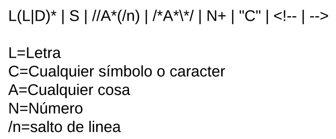
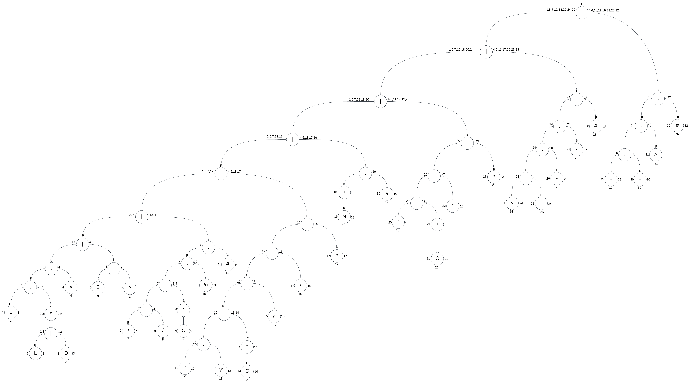
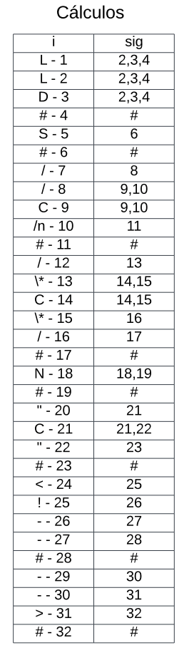
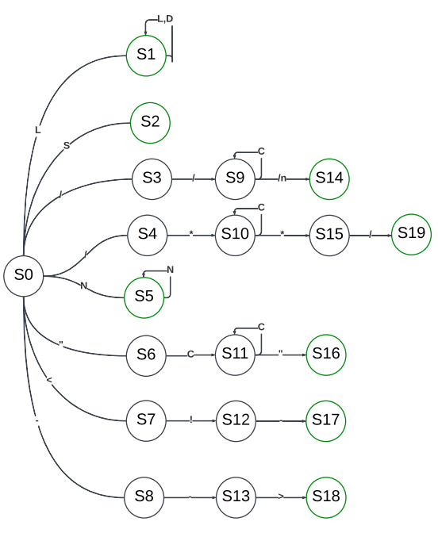
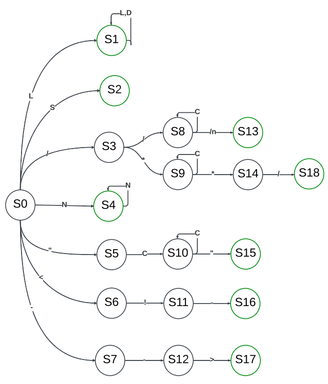

# Manual Técnico - Proyecto 2
## Objetivos
### Objetivo General
- Proporcionar una explicación detallado sobre la manera en la que se creó el programa y su compilador
### Objetivos Específicos
- Presentar y explicar el funcionamiento del código utilizado para la solución creada
- Presentar el arbol utilizado para la creación del autómata 

## Alcances del Sistema
Este manual se creó con la finalidad de permitir entender cómo se realizaron las soluciones del programa y como estas funcionan en conjunto dentro del mismo para cumplir con el proposito del este.
Se pretende propiciar el conocimiento requerido para que se pueda replicar el compilador de ser requerido.

## Especificaciones técnicas
### Requisitos de Hardware
- Procesador con arquitectura x86
- Memoria RAM de 1GB
- Espacio libre en el disco duro de 2GB
- Pantalla
- Teclado (opcional)
### Requisitos de Software 
- Sistema Operativo compatible con Fortran y Python
- Editor de texto compatible con Fortran
- Compilador de Fortran (GNU Fortran, Intel Fortran Compiles, etc)
## Lógica y descripción de la solución
### Calculo del Autómata
Antes de realizar el cálculo del autómata, se creó una expresión regular que se replicaría en el aútomata finito determinsta.



Utilizando esta expresión regular se creó el arbol para posteriormente realizar los cálculos.



Teniendo ya el árbol, se realizó el cálculo de los siguiente de cada nodo hoja.



Con la tabla de siguiente se concluyó con los cálculos hallando cada uno de los estados


Por último, simplemente se armó el autómata con todo lo obtenido.



Apesar de ya tener el autómata realizado, se decidió optimizarlos un poco debido a que tenía ambigüedad en la definición de los comentarios, por lo que se unieron los estados S3 y S4 dándonos el siguiente autómata.



## Lógica de la Descripción


### Interfaz gráfica
La interfaz gráfica de este proyecto 2 se creó utilizando la librería *tkinter*

**Creación de opciones de guardar, guardar como, salir, abrir y nuevo**
Para la creación de estas funciones se usaron botones que simplemente se dispondrian dentro de un *frame*
```python
#Creación del botón para nuevo
nuevo = tk.Button(contenedor, text="Nuevo", height="1", width="11", command=nuevar)
nuevo.pack(side="left")
nuevo.config(background="white", foreground="black", font=("Arial", 10, "bold"))

#Creación del botón para abrir
abrir = tk.Button(contenedor, text="Abrir", height="1", width="11", command=abro)
abrir.pack(side="right")
abrir.config(background="white", foreground="black", font=("Arial", 10, "bold"))

#Creación del botón para guardar
guardo = tk.Button(contenedor, text="Guardar", height="1", width="11", command=guardar)
guardo.pack()
guardo.config(background="white", foreground="black", font=("Arial", 10, "bold"))

#Creación del botón para guardar como
guardoComo = tk.Button(contenedor, text="Guardar como", height="1", width="11", command=guardarComo)
guardoComo.pack()
guardoComo.config(background="white", foreground="black", font=("Arial", 10, "bold"))

#Creación del botón para salir
salir= tk.Button(frame4, text="Salir", height="1", width="9", command=ventana.quit)
salir.pack(side="bottom")
salir.config(background="white", foreground="red", font=("Arial", 13, "bold"))
```
Y se crearón funciones que realizarían cada una de estas acciones (a excepción de una función para salir)
```python
    def abro(): #Función para abrir un archivo
    def guardar(): #Función para guardar el archivo
    def guardarComo(): #Función para guardar el archivo como
    def nuevar(): #Función para empezar un archivo nuevo
```

**Posición del puntero**
En este proyecto era necesario que en un label se mostrara la posición del puntero, por lo que se creo mediante la siguiente función

```python
    def posicion(event):
    x, y = event.x, event.y
    pos.config(text=f"x={x}, y={y}")
```
La cual se vinculo a toda la ventana, esto para saber siempre el la posición del mouse con respecto a cada uno de los *frames*

```python
    ventana.bind("<Motion>", posicion) 
```
### Análisis

El análisis se realizó mediante fortran
