# Manual de Usuario - Proyecto 2
## Objetivos
### General
- Introducir facilmente al comportamiento y funcionamiento del programa
### Especificos
- Presentar el flujo del programa
- Explicar las funcionalidades que provee el programa
## Introducción
Este manual se creó con la finalidad de ayudar al futuro usuario del programa a utilizarlo correctamente, pudiendo aprovechar cada una de las diversar funcionalidades que este programa informático proporciona, otorgando la información de cómo estas trabajan individual y conjuntamente estructurando claramente el flujo del programa y cómo ocurre su ejecución.

Este programa, es una herramienta para creación de paginas web que tiene un área de edición código y un área en donde se presentarán todo los errores del programa. Este programa será capaz de leer archivos con extensión .LFP, los cuales contendrán intrucciones como: Controles, Propiedades y Colocación. Cada una de estas intrucciones que contiene el archivo permitirán el diseño de paginas web, generando código HTML y CSS.
Si hay problemas con la sintaxis o los lexemas utilizados en el programa, este será capaz de listar cada uno de los errores e indicar la posición y el tipo de error que hubo. En caso de no haber ningun error, este generará los archivos, el HTML y el CSS, dentro de una carpeta a la que se podrá acceder posteriormente para visualizar la página.

## Requisito del Sistema
- Poseer el ejecutable
- 1GB de memoria RAM
- Procesador con Arquitectura x86
- Sistema Operativo capaz de leer archivos con extensión .exe
- Pantalla
- Teclado (opcional)

## Flujo de las funcionalidades del programa

1. Para iniciar el programa, primeramente se abre desde un editor de texto, que en esta ocasión será Visual Studio Code.
   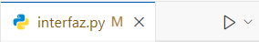
2. Una vez que el programa ya se tiene abierto, se mostrará la siguiente ventana que contendrá cada una de las funcionalidades del programa. Una tabla en la parte inferior en la que aparecerán los errores en caso de que hayan durante el anális; un area sobre la cual se podrá editar el texto que se vaya a ingresar; los distintos botones para manipular el archivo como nuevo, guardar, abrir o guardar como; un botón para salir; otro botón para mostrar los tokens en caso de que no huber ningun error durante el análisis del programa y un botón para realizar ese análsis.
   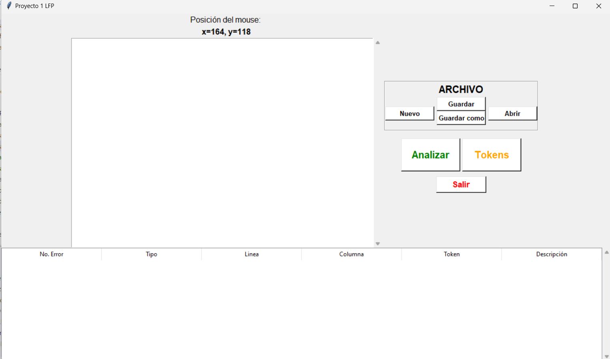
3. Si se intenta guardar un archivo sin que se ingrese ninguna información dentro del editor de texto, no se podrá debido a que mostrará un pantalla que exigirá que se coloque antes algo dentro de este. 
   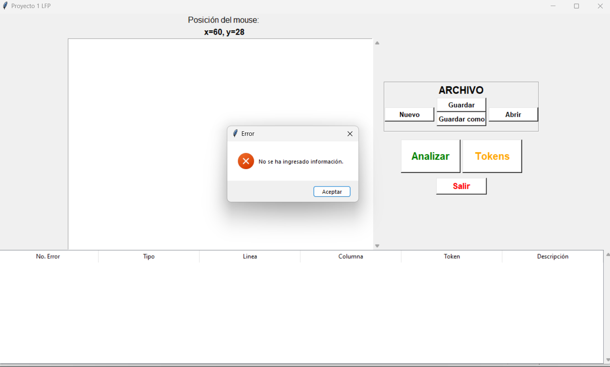
4. Si se pulsa el botón para abrir, se mostrará el explorador de archivos para abrir unicamente los que contenga la extensión *.LFP*. 
   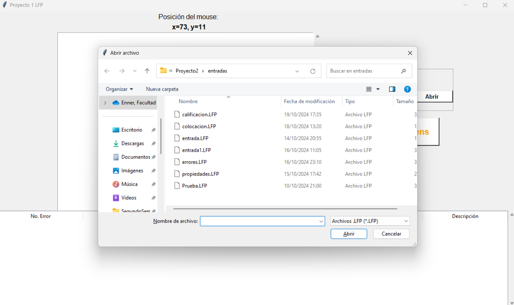
5. Con un archivo ya abierto, este de podrán guardar los cambios pulsando el botón de guardar 
   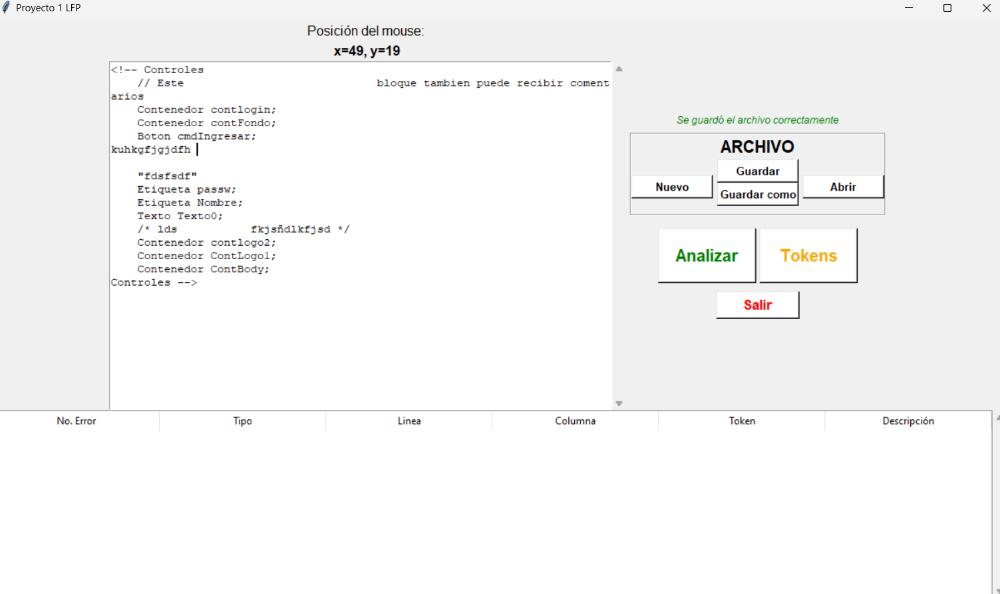
6. Si se quiere guardar como un nuevo archivo, se pulsa el botón de guardar como para que se abra el explorador de archivos y se escoger el nombre y ubicación para guardar el archivo modificado.
   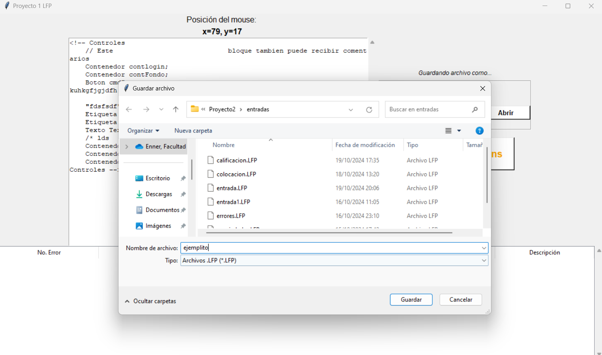
7. Cuando se intenta mostrar los tokens cuando aun no se ha realizado el análisis, aparecerá el siguiente mensaje indicando que no se puede realizar.
   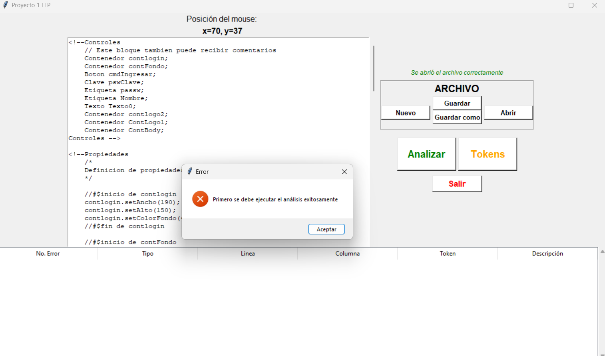
8.  Si al analizar, no hay errores, se mostará el siguiente mensaje emergente que indicará que no hay errores. 
   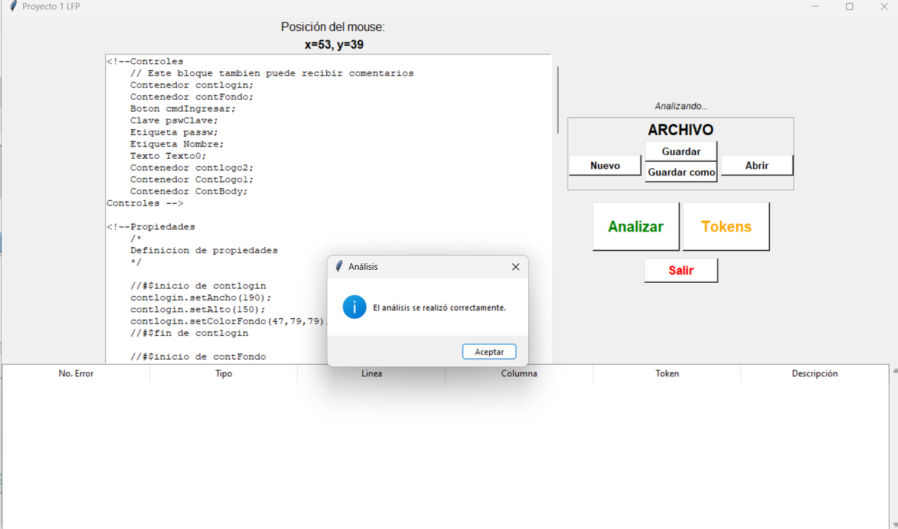
9.  Cuando ya se realizó el análisis y no hubo errores, ya es posible mostrar la tabla de tokens, la cual abrirá el navegador predeterminado y mostrará la tabla en html.
    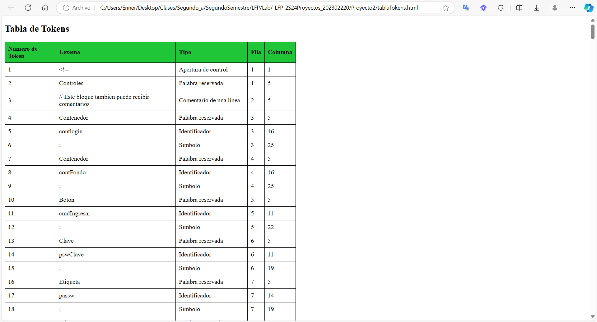 
10. Ahora bien, si se coloca un error dentro del analizador, se mostrará un mensaje que indicará la presencia de este error. 
    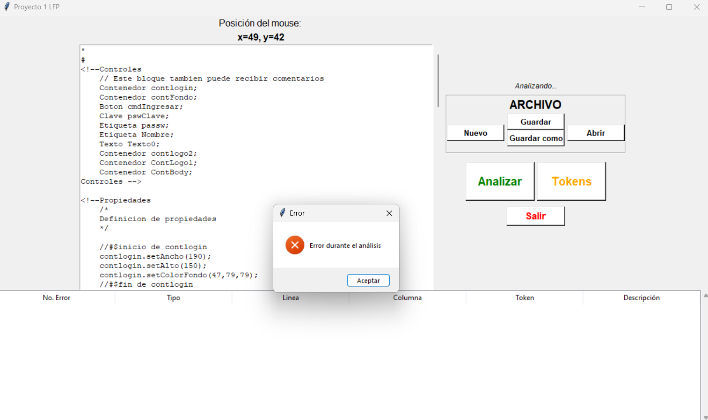 
11. Después del mensaje se mostarán en la tabla cada uno de los errores, tanto léxicos como sintácticos.
    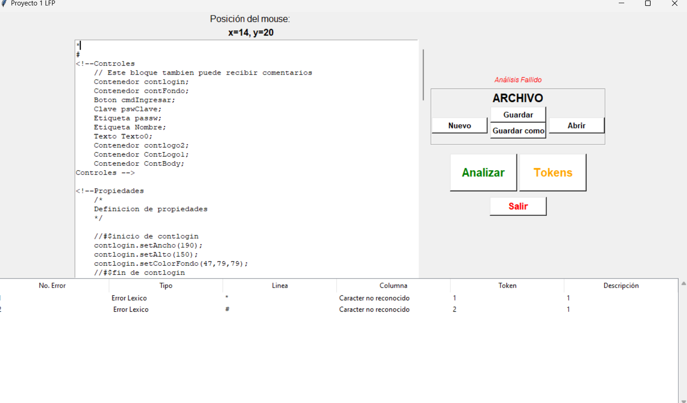
12. Si se pulso la opción para crear un nuevo archivo y no se ha guardado antes, se mostrará un mensaje que preguntará si se desea guardar los cambios.
    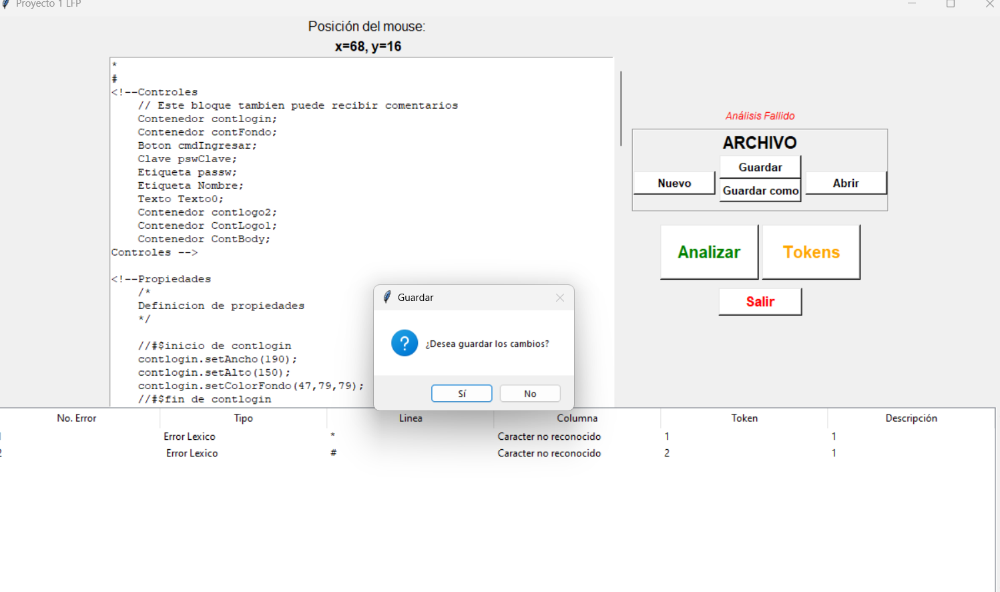
13. Con el análisis realizado de forma existosa, dentro de la carpeta *page* apareceran los dos archivos creados. 
    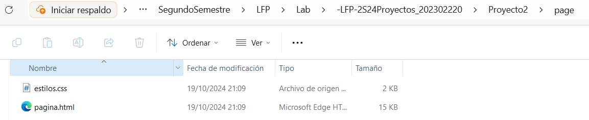
14. Y si se abre, se mostrará la pagina que se creó con el archivo de entrada indicado.  
    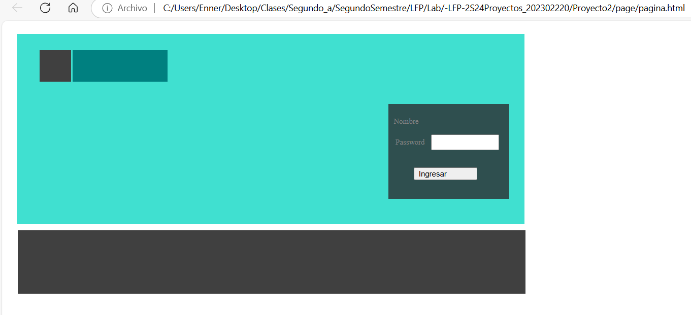
